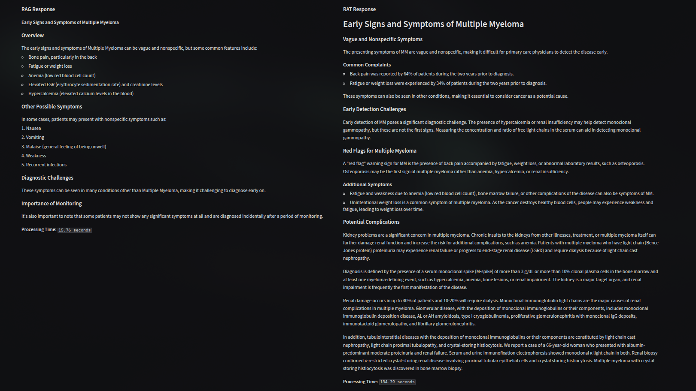
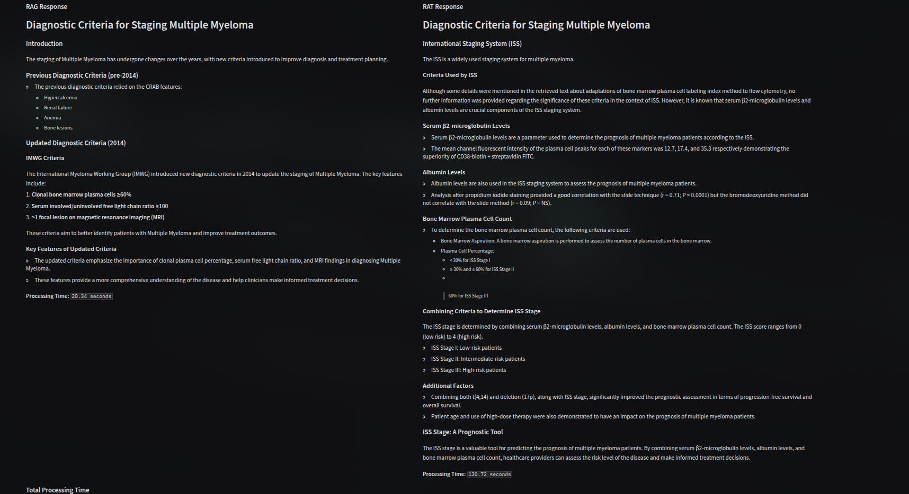
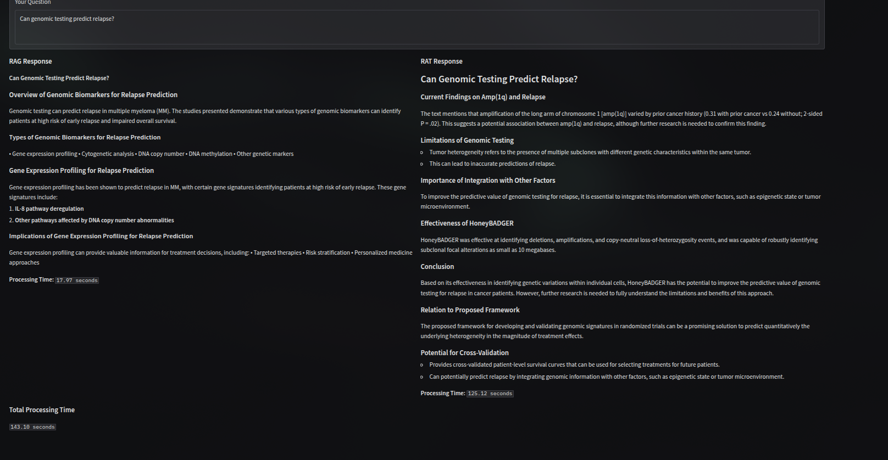
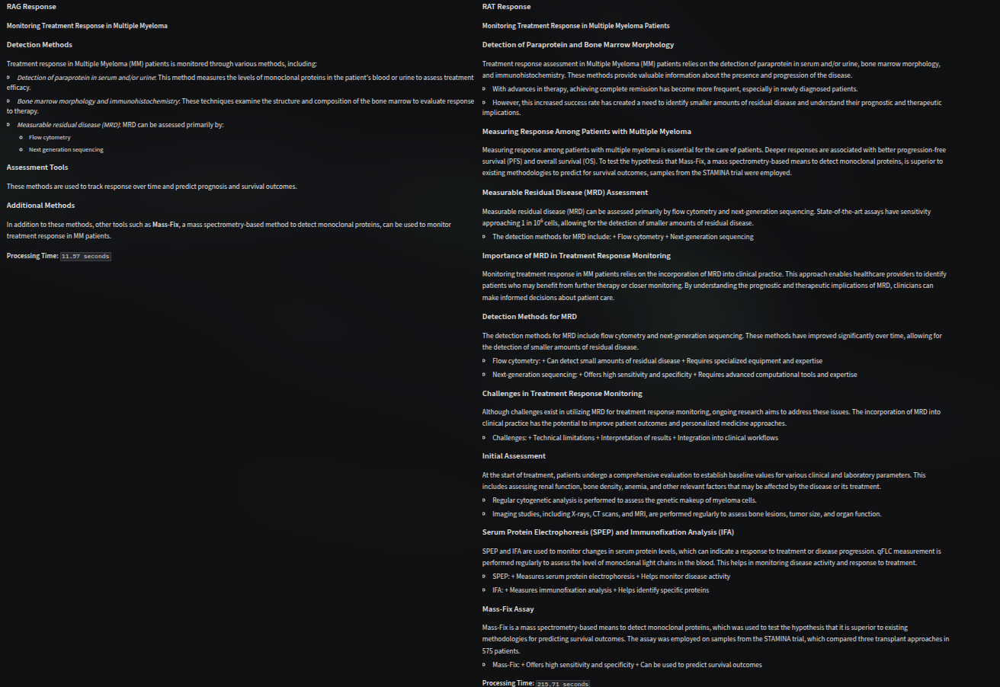

# BriefBot: Retrieval Augmented Thoughts for Enhanced AI Reasoning

**BriefBot** is an intelligent system that combines advanced retrieval techniques with generative AI to create more accurate, context-aware responses. By implementing **Retrieval Augmented Thoughts (RAT)**, the system builds on traditional RAG approaches by iteratively retrieving and incorporating relevant information during the generation process.

---

## 📊 Process Flow Diagram

```
┌─────────────────────────────────────────────────────────────────────────┐
│                          USER SUBMITS QUESTION                          │
└────────────────────────────────┬────────────────────────────────────────┘
                                 │
                 ┌───────────────┴───────────────┐
                 │                               │
         ┌───────▼────────┐              ┌──────▼───────┐
         │   RAG FLOW     │              │   RAT FLOW   │
         └───────┬────────┘              └──────┬───────┘
                 │                               │
                 │                               │
    ┌────────────▼────────────┐      ┌──────────▼──────────┐
    │  1. Query Embedding     │      │ 1. Generate Draft   │
    └────────────┬────────────┘      └──────────┬──────────┘
                 │                               │
    ┌────────────▼────────────┐      ┌──────────▼──────────┐
    │ 2. Retrieve Context     │      │ 2. Split into       │
    │    (k=5 documents)      │      │    Paragraphs       │
    └────────────┬────────────┘      └──────────┬──────────┘
                 │                               │
    ┌────────────▼────────────┐      │  ┌───────▼─────────┐
    │ 3. Generate Answer      │      │  │ For each para:  │
    │    (context + query)    │      │  │                 │
    └────────────┬────────────┘      │  │ • Generate      │
                 │                    │  │   Query         │
    ┌────────────▼────────────┐      │  │ • Retrieve      │
    │ 4. Format Output        │      │  │   Context       │
    └────────────┬────────────┘      │  │ • Revise Para   │
                 │                    │  │ • Show Diff     │
                 │                    │  └───────┬─────────┘
                 │                    │          │
                 │                    │  ┌───────▼─────────┐
                 │                    └──┤ Loop until all  │
                 │                       │ paragraphs done │
                 │                       └───────┬─────────┘
                 │                               │
                 │                    ┌──────────▼──────────┐
                 │                    │ 3. Reflect & Format │
                 │                    └──────────┬──────────┘
                 │                               │
         ┌───────▼────────┐              ┌──────▼───────┐
         │  RAG RESPONSE  │              │ RAT RESPONSE │
         │  + Time Taken  │              │ + Time Taken │
         └────────────────┘              └──────────────┘
```

### Detailed RAT Pipeline

```
┌──────────────────────────────────────────────────────────────────────┐
│                       RAT ITERATIVE PROCESS                          │
└──────────────────────────────────────────────────────────────────────┘

Question → Generate Draft → Split into Paragraphs
                                     │
                    ┌────────────────┴────────────────┐
                    │  Paragraph 1  │  Paragraph 2   │  Paragraph N
                    └───────┬───────┴────────┬───────┴──────┬─────
                            │                │              │
                    ┌───────▼────────┐       │              │
                    │ Create Query   │       │              │
                    │ from Q + Para  │       │              │
                    └───────┬────────┘       │              │
                            │                │              │
                    ┌───────▼────────┐       │              │
                    │ Retrieve Docs  │       │              │
                    │ from Atlas     │       │              │
                    └───────┬────────┘       │              │
                            │                │              │
                    ┌───────▼────────┐       │              │
                    │ Revise Para    │       │              │
                    │ (up to 2 docs) │       │              │
                    └───────┬────────┘       │              │
                            │                │              │
                    ┌───────▼────────┐       │              │
                    │ Visual Diff    │       │              │
                    └───────┬────────┘       │              │
                            │                │              │
                    ┌───────▼────────────────▼──────────────▼─────┐
                    │  Accumulate Revised Paragraphs              │
                    └───────┬─────────────────────────────────────┘
                            │
                    ┌───────▼────────┐
                    │ Final Reflect  │
                    │ (Add titles,   │
                    │  formatting)   │
                    └───────┬────────┘
                            │
                    ┌───────▼────────┐
                    │ Final Answer   │
                    └────────────────┘
```

---

## 🔍 Key Features

- **Retrieval Augmented Thoughts (RAT):** Iterative retrieval during generation process that verifies and improves each reasoning step
- **Document Processing:** Upload and analyze PDF documents using LlamaParse
- **Nomic Atlas Integration:** Connect to semantic vector databases for powerful knowledge retrieval
- **Side-by-Side Comparison:** Compare RAT vs traditional RAG performance
- **Interactive UI:** User-friendly Gradio interface for seamless interaction

---

## 🚀 Getting Started

### Prerequisites

- Python 3.8+
- Nomic API key
- LlamaCloud API key (for document parsing)
- Ollama with llama3.2 model installed

### Installation

```bash
# Clone the repository
git clone https://github.com/Neutrino2003/BriefBot.git
cd BriefBot

# Install dependencies
pip install -r requirements.txt

# Set up environment variables (optional)
cp .env.example .env
# Edit .env and add your API keys
```
### Running the Application

```bash
python main.py
```

The web interface will be available at [http://localhost:7860](http://localhost:7860)

---

## 📝 Usage

### Upload Documents:

1. Click the **"Upload Documents"** button
2. Select PDF files to analyze
3. Click **"Upload"** to process the documents

### Ask Questions:

- Enter your query in the question box
- Click **"Submit Query"** to process
- View both RAG and RAT responses side-by-side

### Compare Results:

- Analyze differences in accuracy, detail, and structure
- Note processing time differences

---

## 🔄 RAT vs RAG: What's Different?

| Feature               | Traditional RAG              | Retrieval Augmented Thoughts      |
|-----------------------|------------------------------|------------------------------------|
| **Retrieval Timing**  | Once, before generation      | Multiple times during generation  |
| **Verification**      | Single context check         | Step-by-step verification         |
| **Complexity Support**| Better for simple Q&A        | Excels at complex reasoning       |
| **Processing Speed**  | Faster processing            | More thorough (takes longer)      |
| **Hallucination Reduction** | Moderate                | Enhanced through iterative checks |

---

## 🧠 Technical Implementation

- **Vector Storage:** Nomic Atlas for semantic document retrieval
- **Document Processing:** LlamaParse for PDF extraction
- **Language Models:** Ollama (llama3.2) for local inference
- **Text Processing:** Custom chunking and token counting utilities
- **User Interface:** Gradio for interactive web components

---

## 📁 Project Structure

```
BriefBot/
├── main.py                      # Application entry point
├── src/
│   ├── config.py                # Configuration and API keys
│   ├── ui.py                    # Gradio web interface
│   ├── document_processing.py   # PDF parsing and chunking
│   ├── reasoning.py             # RAT and RAG implementations
│   ├── retrieval.py             # Nomic Atlas integration
│   └── utils/
│       ├── text_utils.py        # Text chunking and token counting
│       └── diff_utils.py        # Diff visualization
├── requirements.txt             # Python dependencies
└── README.md                    # This file
```

---
## 📸 Results






---

> *Note: This project is a research implementation of Retrieval Augmented Thoughts and is under active development.*
